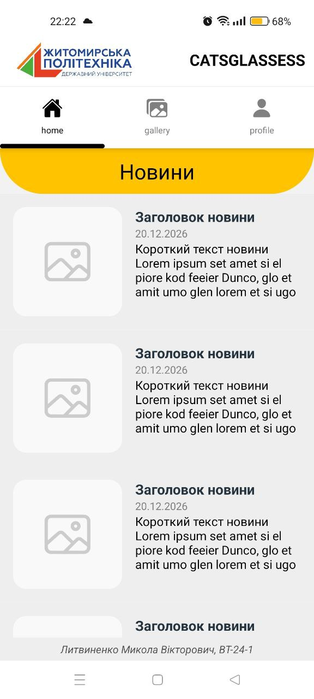
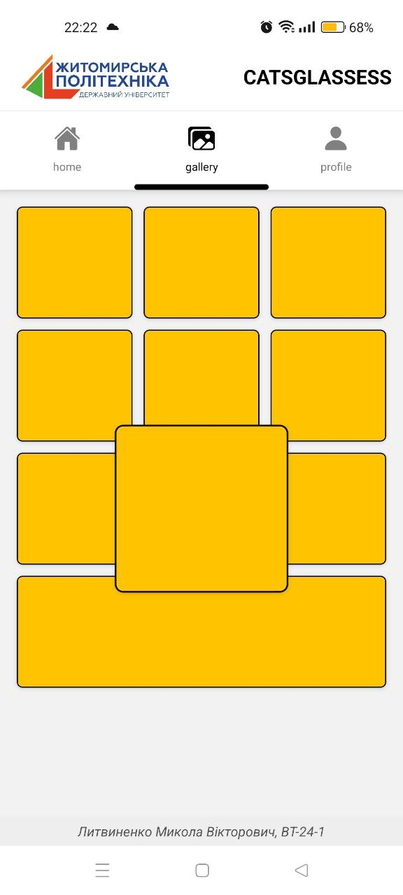
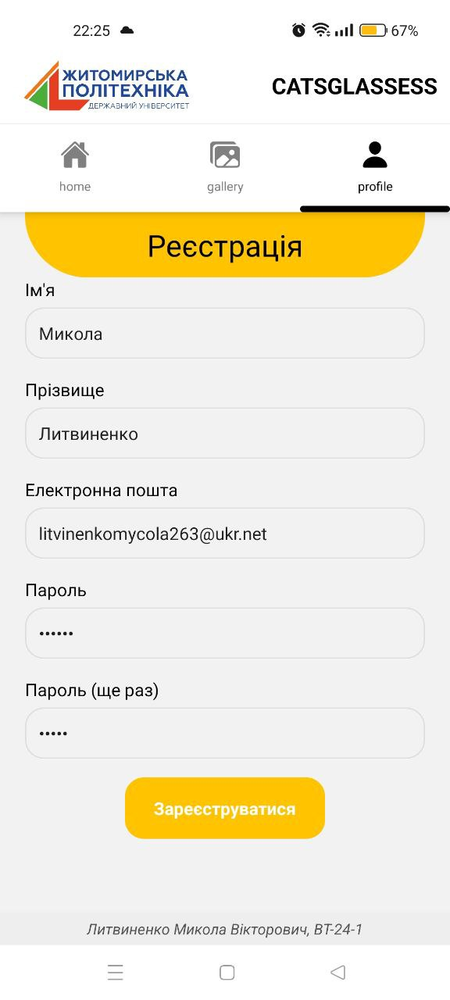
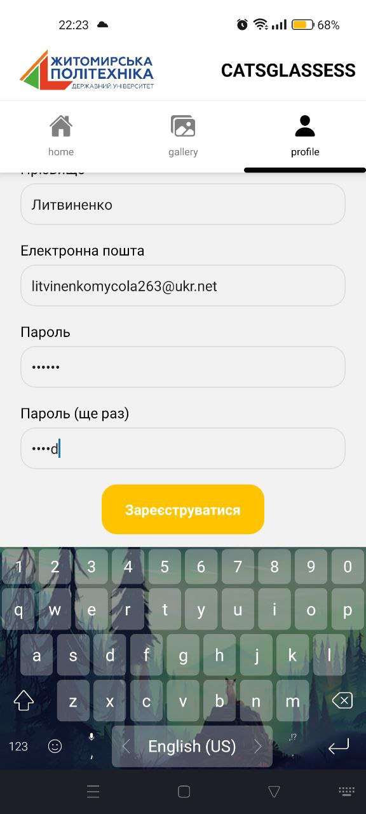

# Лабороторна робота 1: 
Використання Expo для створення найпростішого додатку React
Native. Знайомство з основними компонентами
---

## 📝 Опис
Мій застосунок — це багатосторінковий мобільний застосунок, що демонструє базові принципи побудови інтерфейсів у React Native. 

### Основні можливості:
*   **Верхня таб-навігація:** Використано `@react-navigation/material-top-tabs` для перемикання між екранами за допомогою жестів або натискань.
*   **Екран "home" (Новини):** Динамічний список новин, реалізований через `FlatList`. Кожен елемент містить іконку, заголовок, дату та опис.
*   **Екран "gallery" (Фотогалерея):** 
    *   Сітка з трьох колонок (`numColumns={3}`).
    *   **Інтерактивність:** Було реалізавано компонент `ClicablePhoto` з використанням бібліотеки **Animated**. При натисканні на елемент він плавно збільшується в 1.5 рази за допомогою (`Animated.spring`).
*   **Екран "profile" (Реєстрація):** 
    *   Форма з полями для введення тексту.
    *   **Keyboard Handling:** Використано `KeyboardAvoidingView` та `ScrollView` з відступами для того, щоб вирішити проблему перекриття полів клавіатурою.
    *   Автоматичне приховування клавіатури при натисканні на порожнє місце.

---


## 🚀 Інструкція із запуску

1. **Клонуйте репозиторій:**
   ```bash
   git clone https://github.com/Mycola23/MobileLabsRN2026
   ```

2. **Перейдіть до папки проекту:**
   ```bash
   cd MobileLabsRN2026/lab1
   ```

3. **Встановіть залежності:**
   ```bash
   npm install
   ```

4. **Запустіть проект:**
   ```bash
   npx expo start
   ```

5. **Відкрийте застосунок:**
   *   Відскануйте QR-код через додаток **Expo Go** (для Android) або камеру (для iOS).
   *   Або натисніть `a` для запуску на емуляторі Android.

---

## 📱 Скріншоти застосунку

| Головна Новини | Фотогалерея (при кліку) | Реєстрація Форма |
| :---: | :---: | :---: |
|  |  |  |

# Форма Реєстрація при введенні паролю


---

## 🔍 Опис способів запуску та тестування

Для тестування застосунку використовувалися наступні методи:

### 1. Фізичний пристрій через Expo Go
**Призначення:** Тестування реальної продуктивності та жестів.
*   **Особливості:** Дозволяє відчути реальний відгук інтерфейсу.
*   **Відмінності:** Найточніший спосіб перевірити роботу клавіатури та `SafeAreaView`. Вимагає знаходження пристрою та комп'ютера в одній Wi-Fi мережі якщо не використовуємо `--tunnel`.

### 2. Емулятор Android (через Android Studio)
**Призначення:** Розробка без наявності фізичного пристрою під рукою.
*   **Особливості:** Дозволяє тестувати додаток на різних версіях Android та різних розмірах екранів.
*   **Відмінності:** Швидкий цикл "зміна коду — оновлення", але анімації можуть виглядати менш плавно через обмеження ресурсів ПК.

### 3. Режим Tunnel (`--tunnel`)
**Призначення:** Запуск, коли комп'ютер і телефон знаходяться в різних мережах (наприклад, мобільний інтернет).
*   **Особливості:** Використовує проксі-сервіс (ngrok) для передачі бандла.
*   **Відмінності:** Повільніша швидкість завантаження та можливі затримки при оновленні коду (Hot Reload).

---

## 📂 Структура папки lab1
*   `src/assets/` — локальні зображення.
*   `App.js` — основний файл з логікою, навігацією та стилями.
*   `package.json` — перелік залежностей проекту.

## Висновок
В ході лабораторної роботи було  створено та налаштовувано проєкт у середовищі
Expo, ознайомлено зі структурою React Native застосунку та опанувано
навички роботи з базовими компонентами і трошки з анімаціями та подіями.
