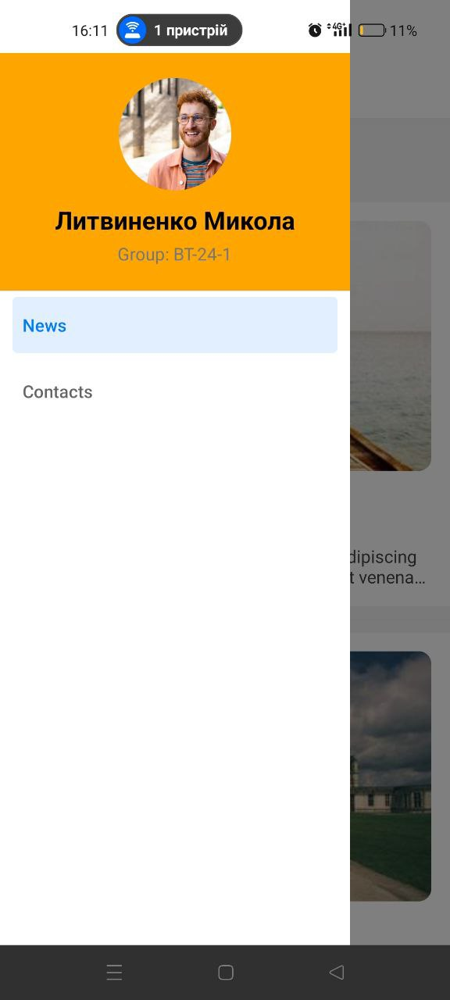
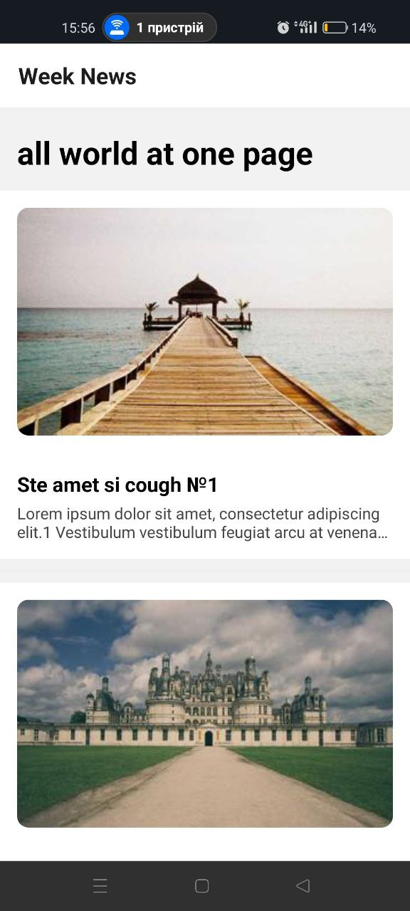
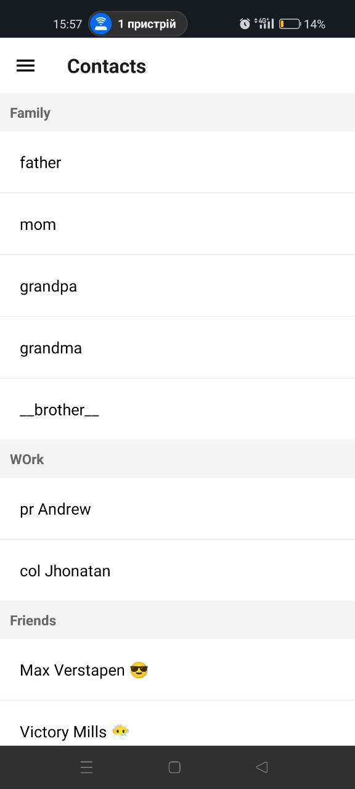
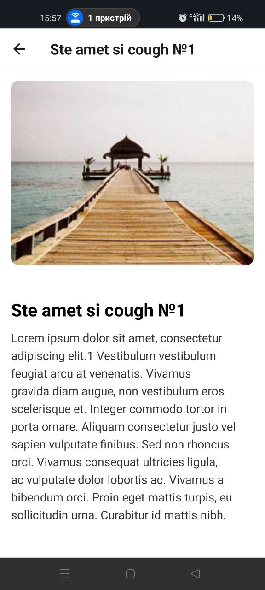
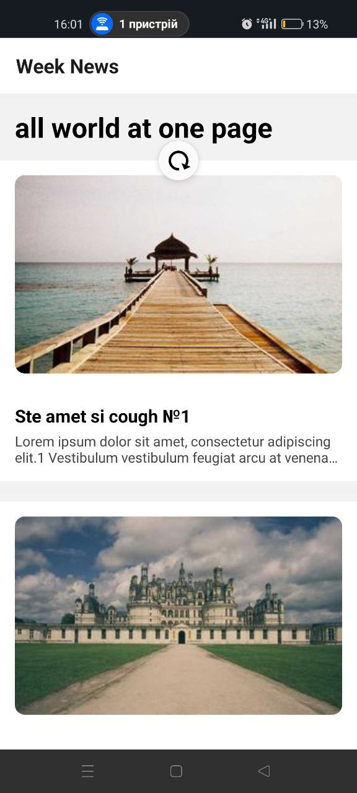
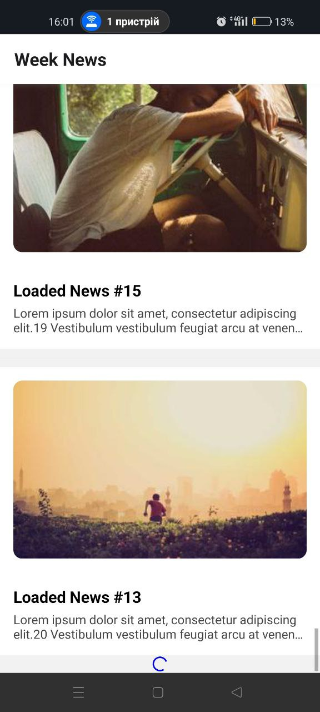

# Лабораторна робота №2: Побудова вкладеної навігації та оптимізація відображення великих списків у React Native

## 📝 Опис
Мій мобільний застосунок - навчальний проект для ознайомлення з різного роду  навігації, щоб забезпечити ефективну роботу з великими масивами даних.

### Основні можливості:
*   **Вкладена навігація (Nested Navigation):**
    *   **Drawer Navigator:** Бокове меню для перемикання між розділами News та Contacts.
    *   **Stack Navigator:** Вкладений у Drawer для переходу від списку новин до деталей конкретної статті.
    *   **Fix Double Header:** Приховую заголовок Drawer для екранів, де використовується Stack, заради уникнути дублювання верхньої панелі.
*   **Список новин :**
    *   **Pull-to-Refresh:** Впроваджено оновлення стрічки жестом зверху вниз.
    *   **Infinite Scroll:** якщо користувач досяг кінця списку автоматично підвантажуються нові дані через  певний проміжок часу 
    *   **Оптимізація:** Використано параметри `initialNumToRender`, `maxToRenderPerBatch` та `windowSize` для плавної роботи списку навіть із сотнями елементів.
*   **Екран контактів :**
    *   Було згруповано дані за алфавітом + використано заголовки секцій.
*   **Кастомний Drawer:** 
    *   Створено власний компонент меню, що має в собі профіль користувача  з аватаром, ПІ, групою та пунктами навігації.

---

## 🚀 Інструкція із запуску

1. **Клонуйте репозиторій:**
   ```bash
   git clone https://github.com/Mycola23/MobileLabsRN2026
   ```

2. **Перейдіть до папки проєкту:**
   ```bash
   cd MobileLabsRN2026/lab2
   ```

3. **Встановіть залежності:**
   *( Використовується фіксована версія Reanimated для стабільності на SDK 52)*
   ```bash
   npm install
   ```

4. **Запустіть проєкт:**
   ```bash
   npx expo start --tunnel
   ```

5. **Відкрийте застосунок:**
   *   Відскануйте QR-код через додаток **Expo Go**, версія sdk застосунку має бути sdk 52.

---

## 📱 Скріншоти застосунку

| Кастомне Drawer Меню | Список Новин (FlatList) | Екран Контактів |
| :---: | :---: | :---: |
|  |  |  |

| Деталі новини (Dynamic Title) | Pull-to-Refresh | Infinite Scroll |
| :---: | :---: | :---: |
|  |  |  |

---

## 📂 Структура проєкту (lab2)
*   `src/testData.js` — генерація тестових даних для новин та контактів
*   `src/mainScreen.js` — реалізація оптимізованого FlatList 
*   `src/DetailsScreen.js` — екран деталей з передачею параметрів
*   `src/ContactsScreen.js` — реалізація SectionList
*   `App.js` — конфігурація вкладеної навігації та кастомного Drawer

---

## 🔍 Контрольні запитання (Висновки)

1. **Чим відрізняється FlatList від ScrollView?**
   `ScrollView` рендерить усі елементи списку відразу, якщо елементів дууже багато - користувач буде змушений чекати довго поки провантажаться всі елементи списку . `FlatList` використовуючи віртуалізацію  рендерить лише ті елементи, які видно на екрані, таким чином зменшуючи навантадення на девайс юзера.

2. **Що таке віртуалізація списків?**
   процес динамічного створення та видалення компонентів списку залежно від позиції прокрутки, дозволяє зберігати швидке реагування інтерфейсу на дії юзера навіть при велих об'ємах даних 

3. **Як здійснюється передача параметрів між екранами?**
   завдяки об'єкту `params` у методі `navigation.navigate('Screen', { id: 1 })`. На цільовому же екрані дані отримуються через пропс `route.params`.

4. **Що таке вкладена навігація?**
   такий архітектурний підхід, при якому один навігатор рендериться всередині екрана іншого навігатора. в даному проекті, Stack Navigator що є всередині однієї з вкладок Drawer Navigator.

5. **У яких випадках застосовується SectionList?**
   Коли  ми маємо згрупувати дані або зберeгти певну   ієрархію структуру, в цій роботі це контакти за групувалися за певними групами такі як `work` `family` та  `friends`.

---

## Висновок
У ході виконання роботи було реалізовано вкладену навігації Drawer + Stack. Також застосовано методи оптимізації `FlatList`, що дозволило забезпечити плавний скролінг великої кількості новин, реалізовано динамічну зміну інтерфейсу залежно від переданих параметрів навігації. Із за проблем з розходженням версій весь проект був написаний під sdk 52.